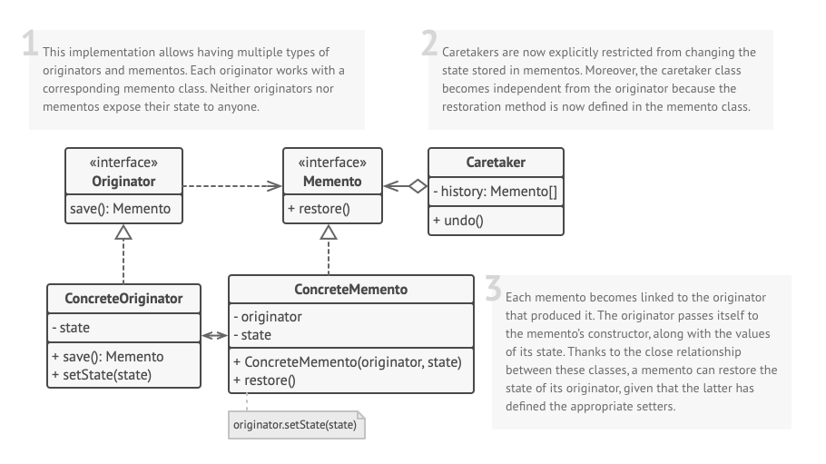

## Intent
**Memento** is a behavioral design pattern that lets you save and restore the previous state of an object without revealing the details of its implementation.

## Illustration

## Structure

